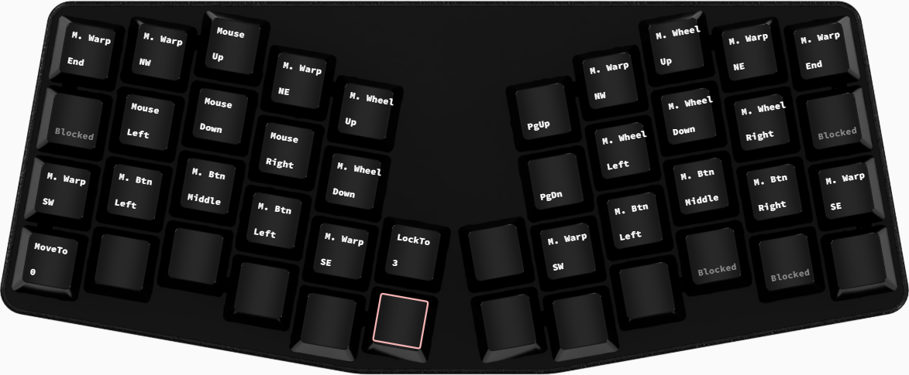
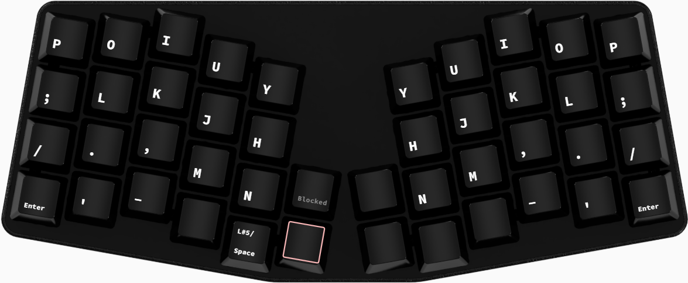

# This is my Chrysalis Key Map for the Keyboardio Atreus.
## Layer 0: Normal
Layers 0, 1, and 2 are fairly typical of what you see in other Atreus layouts. Letters, symbols, digits, and navigation. 
 
## Layer 1: Raise-Symbols-Numpad

## Layer 2: Lower-Navigation-Fkeys

## Layer 3: Adjust-Mouse-Movement
"Adjust" means raise and lower pressed at the same time. This is a mouse movement layer allowing mouse movement, scroll wheel, "warping", and mouse clicks. 

## Layer 4: Mirror-Left-Normal
This layer is one of several geared towards making left-hand-only typing easier, for when the right hand is busy with the mouse.

